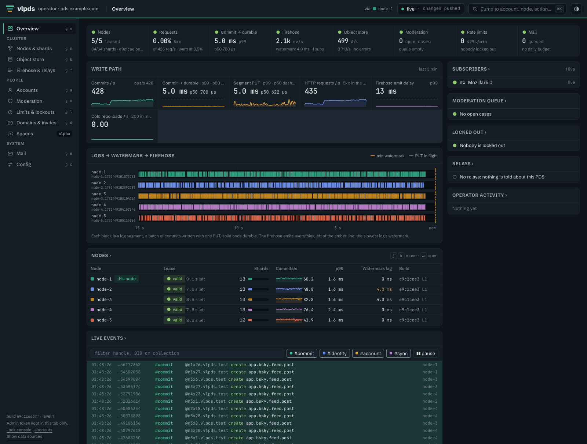

# Very Large PDS (vlpds)

vlpds is an atproto PDS that uses an object store as its database. Every acknowledged write is
already in your S3, R2 or GCS bucket. Nodes only keep caches, so scaling out just means starting
another node on the same bucket.



vlpds speaks the same XRPC, OAuth and sync 1.1 firehose as the reference PDS, so apps, relays and
AppViews talk to it like any other PDS. It can run a personal server on one small VM, or a cluster
on as many nodes as you give it.

There's an example instance at [vlpds.jazco.dev](https://vlpds.jazco.dev). It's a small
single-node deployment (one 4-vCPU VPS with its data on Cloudflare R2), and it serves these docs at
[vlpds.jazco.dev/docs](https://vlpds.jazco.dev/docs).

## Highlights

- The bucket is the only durable state. Writes are group-committed into log segments with
  conditional PUTs, and each shard's state lives in SlateDB on the same bucket. Losing a node or a
  disk only costs you cache. → [Overview](docs/overview.md), [Record storage](docs/record-storage.md)
- There's no coordinator. Any node serves any request. Nodes own shards through leases and
  compare-and-swap on objects in the bucket (no Raft or ZooKeeper). A crashed node's shards move to
  another node in seconds, and shards split and merge online. → [Architecture](docs/architecture.md),
  [Scaling and clustering](docs/operations/scaling-and-clustering.md)
- It's fast, and cheap when idle. One 16-core node does ~60k commits/s against a store with 25 ms
  of injected latency, and a one-shard personal server idles inside R2's free request tier
  (measured: [`bench/results/`](bench/results)). Request costs depend on how many nodes and shards
  you run, not on how fast you write.
- Everything runs in one process. The `vlpds` binary serves XRPC, the OAuth authorization server
  with DPoP, the merged firehose, the account pages, a `/migrate` page for moving an existing
  account in, the operator console and these docs. → [Migration](docs/migration.md),
  [OAuth and 2FA](docs/oauth-2fa.md)
- Users get account controls the reference doesn't have: trusted browsers, sign-in alerts, OAuth
  only, scoped app passwords and a guided handle change. vlpds also acts on the `deleteAfter` an
  app passes to `deactivateAccount`, after a 3-day hold. → [The account page](docs/oauth-2fa.md#the-account-page),
  [Scheduled deletion](docs/operations/email-and-moderation.md#scheduled-deletion)
- The operator console covers accounts, invites, takedowns and moderation cases, rate limits,
  relays, cluster ownership and live metrics. An admin CLI makes the same calls.
  → [Admin console and CLI](docs/operations/admin-console.md)
- Spaces, atproto's permissioned-data alpha, is built in behind `--spaces`. A node hosts its
  accounts' private space repos and the spaces they run, and space writes never reach the
  firehose. → [Spaces](docs/spaces/index.md)
- It's built to be operated. It has Prometheus metrics, 92 alerts that each have a runbook
  section, rolling upgrades with feature levels, Cloud KMS or a local key wrapping every signing
  key, SMTP mail and Ozone moderation. → [Operations](docs/operations/index.md)

## Quickstart

The quickest way to try it is the published image. This runs an in-memory server in dev mode:

```sh
docker run --rm -p 2583:2583 ghcr.io/jazware/vlpds --memory --dev-mode --public-url http://127.0.0.1:2583
```

Open <http://127.0.0.1:2583> for the account pages and <http://127.0.0.1:2583/admin> for the
console (the dev admin token is `dev-admin-token`).

The image is built for `linux/amd64` and `linux/arm64`. A release like v1.0.0 is tagged `1.0.0`,
`1.0` and `latest`. `main` follows the main branch, and `sha-<commit>` pins one build of it.

To build from source, with Rust, Node and [just](https://github.com/casey/just) installed:

```sh
git clone https://github.com/jazware/vlpds && cd vlpds
just dev     # builds the UI and the binaries, then runs an in-memory server on :2620
just seed    # in another shell: 3 accounts with 200 records each (password: hunter2)
```

Open <http://127.0.0.1:2620> for the account pages, <http://127.0.0.1:2620/admin> for the console
(the dev admin token is `dev-admin-token`) and <http://127.0.0.1:2620/docs> for the docs.

The in-memory store doesn't keep anything. `just minio` starts a local MinIO you can point a node
at, and [Deploy](docs/operations/deploy.md) walks through setting up a real server with the Ansible
kit in [`deploy/ansible/`](deploy/ansible/README.md).

## Documentation

The docs live in [`docs/`](docs), and every node serves them at `/docs`.

| Start here | Run it | How it works |
|---|---|---|
| [Overview](docs/overview.md) | [Deploy](docs/operations/deploy.md) | [Architecture](docs/architecture.md) |
| [Migration](docs/migration.md) | [Configuration](docs/operations/configuration.md) | [Record storage](docs/record-storage.md) |
| [OAuth and 2FA](docs/oauth-2fa.md) | [Object store](docs/operations/object-store.md) | [State storage](docs/state-storage.md) |
| [Keys and security](docs/keys-security.md) | [Scaling and clustering](docs/operations/scaling-and-clustering.md) | [Firehose](docs/firehose.md) |
| | [Monitoring](docs/operations/monitoring.md) | [Blobs](docs/blobs.md) |
| | [Upgrades](docs/operations/upgrades.md) | [Proxying](docs/proxying.md) |
| | [Runbook](docs/operations/runbook.md) | [Spaces](docs/spaces/index.md) (alpha) |
| | | [DESIGN.md](DESIGN.md) (the full design notes) |

If you're running a server, you'll also want [ops/RUNBOOK.md](ops/RUNBOOK.md) and
[ops/alerts.yml](ops/alerts.yml). [tests/STATUS.md](tests/STATUS.md) describes the test suite, and
[bench/](bench) has the load, HA and soak harnesses behind the numbers.

The object-store client, the log segment format and the firehose live in
[`vlsync`](https://github.com/jazware/vlsync), crates vlpds shares with vlRelay and delta, and the atproto data model and
crypto in [`vlatproto`](https://github.com/jazware/vlatproto). This crate is the PDS on top of them.

## Status

vlpds is new. It has a conformance suite modeled on the reference PDS's tests, differential tests
against a second atproto implementation, and HA, upgrade and soak harnesses, but it hasn't seen
wide use yet. Expect rough edges, and keep the two offline secrets (the KEK and the PLC rotation
key) backed up.

## License

[MIT](LICENSE)
